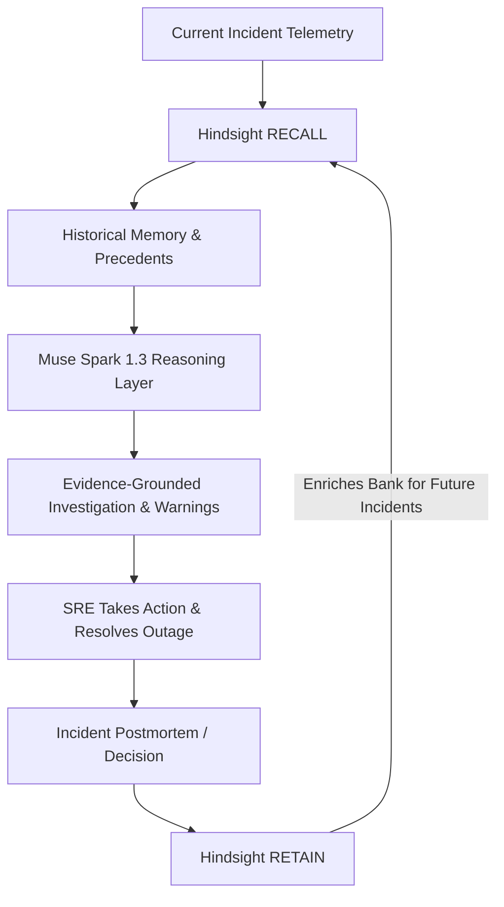

# OpsMind Memory Engine Architecture

> **OpsMind — Persistent AI Engineering Memory for Incident Response & SRE Teams**

---

## 1. Why OpsMind Uses Hindsight

In traditional engineering organizations, incident response knowledge is fragmented across Slack threads, Jira tickets, Google Docs postmortems, and individual engineers' memories. When an outage strikes at 3:00 AM, the responding engineer typically starts from scratch or relies on keyword searches across noisy documentation.

Standard vector databases (RAG) treat text merely as static embedding coordinates. They lack:
* Temporal awareness (knowing when an incident happened, whether a policy superseded a previous practice, and chronological ordering).
* Entity-relation extraction (understanding that `payment-api` connects to `PostgreSQL` and depends on `stripe-gateway`).
* Distillation of **experience** versus raw logs (separating root cause, successful fixes, and dangerous anti-patterns).

**Hindsight** is chosen as the foundational persistent memory layer for OpsMind because:
1. **True Engineering Experience**: Hindsight extracts facts, temporal anchors, entity state changes, and causal relationships from retained incident narratives.
2. **Dynamic Evolution**: As new incidents occur and postmortems are stored, Hindsight updates its mental models and entity knowledge graphs, enabling the agent to learn from real-world outcomes over time.
3. **Evidence-Grounded Recall**: Hindsight provides structured memory recall (`to_prompt_string()`, entity summaries, and fact units) that allows the reasoning model (Meta Muse Spark 1.3) to cite specific historical incidents rather than hallucinating generic advice.

---

## 2. What Is Stored in Hindsight

OpsMind stores **structured engineering experience**, not raw unparsed documents or telemetry dumps. Every memory unit includes:

| Attribute | Description | Example |
| :--- | :--- | :--- |
| **`incident_id`** | Unique incident or decision ID | `INC-1042`, `DECISION-PAYMENT-RESTART` |
| **`service`** | Target microservice | `payment-api`, `orders-api` |
| **`environment`** | Deployment environment | `production`, `staging` |
| **`deployment_version`**| Release tag or version hash | `v2.9.0` |
| **`symptoms`** | Observable telemetry & alerts | `HTTP 502 Bad Gateway spike after deploy` |
| **`suspected_cause`** | Initial hypothesis during triage | `Database connection bottleneck` |
| **`confirmed_root_cause`**| Diagnosed postmortem root cause | `Connection pool pool_max reduced from 50 to 5` |
| **`investigation_steps`**| Sequence of triage actions | `1. Check ingress ALB. 2. Diff Helm values.` |
| **`actions_taken`** | Interventions executed | `Rolled back to v2.8.4; restored pool_max=50` |
| **`resolution`** | Final remediation | `Rollback and configuration restoration` |
| **`outcome`** | Objective result | `Successful - errors returned to baseline in 2m` |
| **`failed_approaches`**| Actions that failed or worsened state | `Considering pod scale-out before fixing pool` |
| **`successful_approaches`**| Actions that quickly verified fix | `Git diff comparison between v2.8.4 and v2.9.0` |
| **`engineering_decisions`**| Formal team policies | `Do not blindly restart payment-api under load` |
| **`warnings`** | Anti-patterns and dangers | `Restarts cause uncommitted 2PC retry storms` |
| **`lessons_learned`** | Postmortem learnings | `Compare pool limits before restarting pods` |

---

## 3. How RETAIN Works

The retention pipeline converts postmortems and incident outcomes into Hindsight memory units:

```text
Postmortem / Engineering Decision
               │
               ▼
   [EngineeringMemory Domain Model]
               │
               ├─ to_experience_document()  ──> Natural language narrative
               ├─ extract_metadata()        ──> Key-value pairs (service, version, env)
               └─ extract_tags()            ──> Categorical tags (payment-api, incident)
               │
               ▼
    [HindsightMemory.retain()]
               │
               ▼
 Hindsight API Server (extracts facts, entities, relations)
```

1. **Structured Ingestion**: The engineer or CI/CD workflow submits an incident resolution payload to `POST /api/memory/retain`.
2. **Experience Formulation**: The model transforms structured fields into a structured natural language narrative emphasizing causation: what symptoms occurred, what was tested, what caused harm, and what resolved the issue.
3. **Metadata & Entity Tagging**: Service name, environment, incident ID, and tags are bound to the document.
4. **Hindsight Ingestion**: The official `hindsight-client` transmits the payload to the designated memory bank (`opsmind-engineering`).

---

## 4. How RECALL Works

When a new incident occurs, OpsMind queries Hindsight for past precedents:

```text
Current Incident (service, symptoms, deployment version)
               │
               ▼
 [construct_incident_query()]
 "Service: payment-api | Environment: production | Symptoms: HTTP 502 ... | Deployment: v2.9.1"
               │
               ▼
    [HindsightMemory.recall()]
               │
               ▼
  [Hindsight Memory Bank]
  Matches relevant past facts, entity states, and anti-patterns
               │
               ▼
 [RecallResponse]
 Contains:
 - RecallResult[] (individual facts, scores, contexts, tags)
 - to_prompt_string() (LLM-ready prompt facts & entity observations)
```

1. **Context-Rich Query Construction**: Rather than a vague phrase, the query packs service identity, deployment tag, and observed anomalies.
2. **Hindsight Traversal**: Hindsight evaluates semantic proximity, entity graphs, and chronological relevance in the bank.
3. **Structured Packaging**: The response delivers matched facts along with metadata, identifying specific past incidents (such as `INC-1042` or `INC-1091`).

---

## 5. How Recalled Memory Reaches Muse Spark 1.3

Recalled memories do not merely sit in a database; they are injected as **empirical evidence** into the Meta Muse Spark 1.3 reasoning prompt.

The prompt strictly enforces evidence boundaries:

```text
=== CURRENT INCIDENT ===
Incident ID: INC-DEMO-502
Service: payment-api
Deployment: v2.9.1
Symptoms:
- HTTP 502 responses increased immediately after deployment
- Gateway timeouts

=== HISTORICAL MEMORY (Retrieved from Hindsight persistent memory) ===
Total Memories Recalled: 3
FACTS:
- INC-1042: Database connection pool regression causing 502s in payment-api after deployment
- INC-1067: Environment variable timeout misconfiguration causing 502s
- INC-1091: Emergency restart caused duplicate customer payment processing
- DECISION-PAYMENT-RESTART: Strictly forbids blind restarts of payment-api

=== INVESTIGATION OBJECTIVES ===
1. Compare symptoms against historical memory.
2. Ground possible root causes in historical precedent.
3. Elevate critical warnings (e.g. against restarting payment-api).
```

### Distinguishing Evidence from Hypothesis:
* If Hindsight returns relevant records:
  * Muse Spark 1.3 explicitly references them by ID (`INC-1042`, `INC-1091`).
  * Recommendations cite past successful actions (e.g., check pool configuration diff).
  * Warnings cite recorded pitfalls (e.g., blind restart warning).
* If Hindsight returns **no records**:
  * Muse Spark 1.3 sets `memory_used: false` and `confidence: "Low - Insufficient Historical Evidence"`.
  * The model explicitly notes that the team has no recorded precedent for this failure.
  * The model is forbidden from inventing or hallucinating past incident IDs.

---

## 6. Why PostgreSQL Should Not Replace Hindsight

As OpsMind expands, PostgreSQL may be introduced for operational tables (user accounts, session management, incident logs, audit trails). However, **PostgreSQL must not replace Hindsight**:

| Capability | PostgreSQL (Relational DB) | Hindsight Persistent Memory |
| :--- | :--- | :--- |
| **Storage Paradigm** | Static rows, columns, foreign keys | Semantic fact graphs, temporal networks, entity observations |
| **Retrieval Mechanism**| Exact SQL match / full-text indexing | Semantic similarity, contextual relevance, associative recall |
| **Learning Over Time** | Rows remain static unless manually updated | Continuous distillation, entity state updates, cross-incident synthesis |
| **Prompt Integration**| Requires custom manual SQL query composition | Native `to_prompt_string()`, fact-chunk linking, token-budgeted recall |
| **Cognitive Fit** | System of Record for transactions | System of Intelligence for engineering reasoning |

PostgreSQL serves as the transactional store; Hindsight serves as the cognitive memory bank.

---

## 7. The Continuous Learning Loop

OpsMind establishes an operational flywheel where every resolved incident makes the agent smarter for the next incident:



1. **Incident Emerges**: Telemetry arrives at OpsMind.
2. **Recall**: Hindsight retrieves matching incidents and anti-patterns.
3. **Reason**: Muse Spark 1.3 synthesizes current symptoms with past evidence.
4. **Act**: The SRE resolves the incident with high confidence, avoiding dangerous actions (like blind restarts).
5. **Retain**: The new resolution is stored back into Hindsight.
6. **Compound**: Future incidents benefit from this updated operational memory.
